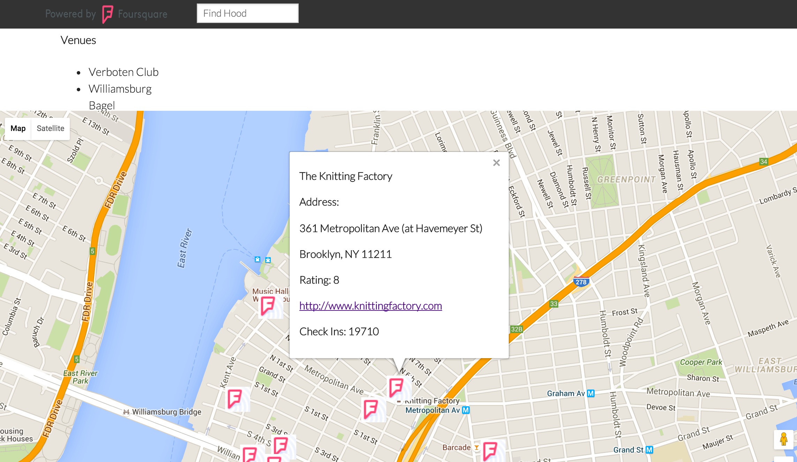

# Neighborhood App

By: Yaz Khoury

This application allows a user to search a neighborhood on Google Maps and get a list of top places
using the Foursquare API.

A preview of the app is show in the following screenshot:



The app uses Knockout.js for the MVVM structure, Google Maps for the map layout, Foundation for grid structure, and
Foursquare API to bring you back top places based on your selection.

The following instructions allow you to build the application
into the 'dist' folder. If you want to run a prebuilt version,
just open index.html in the current 'dist' folder.

You can read the files for review in the 'src' folder.

```Shell
npm install -g bower
```

After that, install components in bower.json by using this command:

```Shell
bower install
```

Next, install package.json components:

```Shell
npm install
```

Now, run gulp:

```Shell
gulp
```

Now, cd to dist directory. Initiate a simple server with the following command:

```Shell
python -m SimpleHTTPServer
```

Go to your browser and go to 0.0.0.0:8000 on your address bar to begin using the app.

Bibliography:

1. http://stackoverflow.com/questions/309953/how-do-i-catch-jquery-getjson-or-ajax-with-datatype-set-to-jsonp-error-w/310084#310084
2. https://developer.foursquare.com/docs/venues/search
3. https://developers.google.com/maps/documentation/javascript/places
4. http://learn.knockoutjs.com/
5. http://foundation.zurb.com/docs/
6. https://github.com/DawoonC/dw-neighborhood
7. https://github.com/aruballo/neighborhoodapp
8. http://stackoverflow.com/questions/29557938/removing-map-pin-with-search
9. https://github.com/kacymckibben/project-5-app